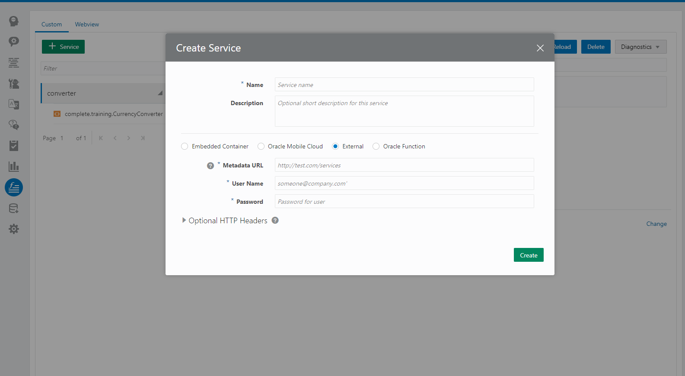

# ODA


## Custom component
Sempre que precisarmos integrar nosso bot com ferramentas externas como, bancos de dados, apis ou até mesmo um grande CRM, iremos utilizar os **custom components**

Para desenvolver os **Custom Components** iremos utilizar o SKK [bots-node-sdk](https://github.com/oracle/bots-node-sdk) que é fornecido pela propria Oracle.

A instalação é feita através do comando. 

npm install -g @oracle/bots-node-sdk (o SDK será instalado de forma global)

Depois disso vamos precisar criar um **Custom Component Package** para isso usamos o seguinte comando 

bots-node-sdk init <top-level folder path>

O comando acima irá gerar um boilerplate como mostrado a baixo

### Estrutura

```text
.
├── .npmignore
├── components
│   └── ...
├── main.js
├── package.json
├── Dockerfile
├── docker-compose.yml
└── spec
    └── ...
```
| Nome arquivo | Descrição  
| `.npmignore` | Arquivos que devem ser ignorados pelo _npm_  
| `components` | Diretório padrão onde os Components serão "desenvolvidos"  
| `main.js` | Entrypoint para as configurações do component  
| `Dockerfile` | Arquivo de configuraçao do docker  
| `docker-compose.yml` | Arquivo de configuração do docker-compose   
| `spec` | Testes unitarios   

Este é um pacote NPM normal tudo o que você irá utilizar em seus Componentes devem ser instalados via npm ou yarn 

## Subindo um servidor de desenvolvimento

> **TIP:** Você pode utilizar o  [`ngrok`](https://ngrok.com/) para testar seus componentes localmente.  
> Para isso você precisa ir no seu dashboard e logo depois clicar na aba **Components** e adicione um **Service** to tipo **External**  
> Na URL coloque o link gerado pelo ngrok
>   

```shell
npm start
# or run with additional options
npm run bots-node-sdk -- service .
# or run with debugger
node --inspect $(npm bin)/bots-node-sdk service .
```

With custom component services running, test endpoints like so:

```shell
# get component metadata
curl -X GET localhost:3000/components

# invoke custom component
curl -H "Content-Type: application/json" -d @./spec/test.cc.req.json localhost:3000/components/helloWorld

# invoke entity event handler component
curl -H "Content-Type: application/json" -d @./spec/test.eh.req.json localhost:3000/components/resolveentities/helloWorld
```

## Deployment

As this package is designed to be installed and run with a corresponding service
wrapper, run `npm pack` and upload the resulting `.tgz` as a package for
the _Embedded Container_ service.

```shell
npm pack
# or validate and package with the @oracle/bots-node-sdk command line
npm run bots-node-sdk -- pack .
```

> **TIP:** use `npm run bots-node-sdk -- pack --help` for additional packaging
options.

Run the following commands to deploy to docker and start the container:
```shell
npm run-script docker-build
docker-compose up
```
