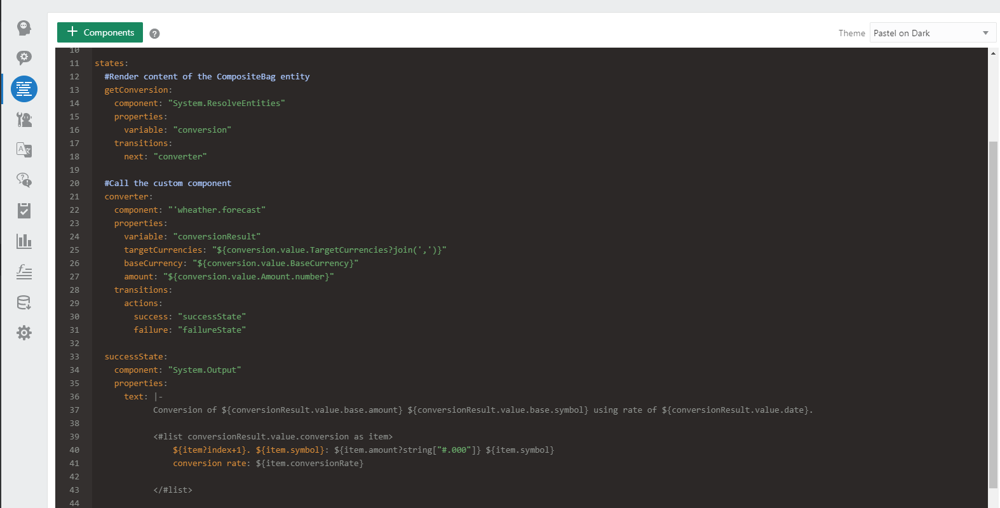

> # Dialog flow  

> ### O que é?  
> É no dialog flow que se define o fluxo do dialogo que o bot terá com o usuário final  
>   
> Para criar o **dialog flow** utilizamos o **OBotML** que é uma implementação do YAML do ODA.   

> ### Estruturando um Dialog Flow  
> 
> A estrutura de um Dialog Flow é dividida em três partes **context**, **defaultTransitions** e **states**  
> As veriaveis globais devem ser defidas no **context**  
> O fluxo em si deve ser definido na sessão de **states**  
> 
>  Abaixo exemplo de código em OBotML:
```YAML
main: true
name: "HelloKids"
context:
  variables:
    variable1: "entity1"
    variable2: "error"
...
States      
    state1:
      component: "a custom or built-in component" 
      properties: 
        property1: "component-specific property value"
        property2: "component-specific property value"
      transitions:
        actions:
          action1: "value1"
          action2: "value2"
    state2:
      component: "a custom or built-in component" 
      properties: 
        property1: "component-specific property value"
        property2: "component-specific property value"
      transitions:
        actions:
          action1: "value1"
          action2: "value2"
...
```
> ### Context
> As variavés declaradas dentro de **context** devem ser de tipos primitivos como int, string, boolean ou float  
> Também podemos declarar variavies para as entidades integradas ou personalizadas.  
> Outro tipo de variavel que podemos declarar são do tipo _nresult_ que contem o intent resolvido pela entrada do usuário

```YAML
main: true
name: "PizzaBot"
context:
  variables:
    size: "PizzaSize"
    type: "PizzaType"
    crust: "PizzaCrust"
    iResult: "nlpresult"
```

>### defaultTransitions
> É possivel 
